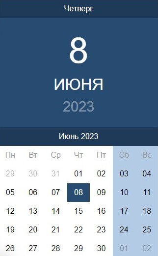

# Страница интернет-магазина

Учебный проект курса [React для JS-разработчиков](https://netology.ru/programs/react)

## **Задача**

Создание React-компонета Calendar (функциональный компонент), который бы показывал текущую дату и текущий месяц

## **Описание компонента**

Компонент должен иметь один атрибут `date`, в котором он ожидает текущую дату, объект `Date`.

Компонент должен создавать DOM элемент следующей структуры:

```JavaScript
<div class="ui-datepicker">
  <div class="ui-datepicker-material-header">
    <div class="ui-datepicker-material-day">Среда</div>
    <div class="ui-datepicker-material-date">
      <div class="ui-datepicker-material-day-num">8</div>
      <div class="ui-datepicker-material-month">Марта</div>
      <div class="ui-datepicker-material-year">2017</div>
    </div>
  </div>
  <div class="ui-datepicker-header">
    <div class="ui-datepicker-title">
      <span class="ui-datepicker-month">Март</span>&nbsp;<span class="ui-datepicker-year">2017</span>
    </div>
  </div>
  <table class="ui-datepicker-calendar">
    <colgroup>
      <col>
      <col>
      <col>
      <col>
      <col>
      <col class="ui-datepicker-week-end">
      <col class="ui-datepicker-week-end">
    </colgroup>
    <thead>
      <tr>
        <th scope="col" title="Понедельник">Пн</th>
        <th scope="col" title="Вторник">Вт</th>
        <th scope="col" title="Среда">Ср</th>
        <th scope="col" title="Четверг">Чт</th>
        <th scope="col" title="Пятница">Пт</th>
        <th scope="col" title="Суббота">Сб</th>
        <th scope="col" title="Воскресенье">Вс</th>
      </tr>
    </thead>
    <tbody>
      <tr>
        <td class="ui-datepicker-other-month">27</td>
        <td class="ui-datepicker-other-month">28</td>
        <td>1</td>
        <td>2</td>
        <td>3</td>
        <td>4</td>
        <td>5</td>
      </tr>
      <tr>
        <td>6</td>
        <td>7</td>
        <td class="ui-datepicker-today">8</td>
        <td>9</td>
        <td>10</td>
        <td>11</td>
        <td>12</td>
      </tr>
      <!-- остальные недели -->
    </tbody>
  </table>
</div>
```
## **Стек технологий**


При разработке испотльзована библиотека ***Moment.js***

## [**Демо**](https://calendar-fawn.vercel.app/)
